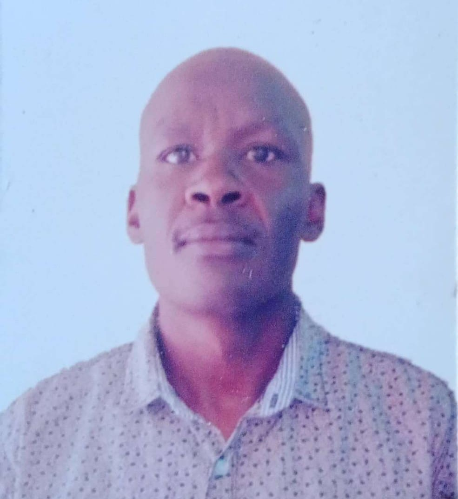

---
hide:
  - toc
  - navigation
---
<!--
CHECKLIST FOR THIS PAGE:
- [ ] Replace [Cheruiyot Buses Kipngeno] with your full name (3 places)
- [ ] Replace [Geospatial Scientist] with your current or target role
- [ ] Replace [Turning Raw geospatial data into useful Insights for planning and decision making] with a short phrase describing your focus
- [ ] Rewrite the About Me paragraph with your own words
- [ ] Replace assets/images/profile.png with your actual photo (keep the filename or update it below)
- [ ] Replace assets/images/about.png with your own image (a field photo, map, or workspace shot)
- [ ] Edit the skill cards to match your actual skills (add, remove, or rename cards as needed)
- [ ] Update GitHub and LinkedIn links in the Connect section
- [ ] Add your CV PDF to docs/assets/ and update the filename in the Download CV button
-->

  
  <h1>CHERUIYOT</h1>
  
<strong>GEOSPATIAL-ENVIRONMENTAL SCIENTIST</strong>

  
<em>[Turning Geo-spatial data into insights that informs decision making| GIS | Remote Sensing | Python]</em>

---

## About Me

I am a geospatial-environmental data scientist with a background in remote sensing and machine learning and Environmental Science.
I work on extracting actionable insights from satellite imagery and large spatial datasets
using Python, Google Earth Engine,ArcGIS and open-source GIS tools. I am passionate about applying GeoAI techniques to real-world challenges in land use mapping, Disaster Maagement, climate monitoring, and urban planning. I am currently seeking for consulting opportunities in GIS, Remote Sensing, Data Management, Data Analysis and Spatial-Environmental Modelling.

  

---

[View My Projects :material-arrow-right:](projects/index.md){ .md-button .md-button--primary }
[Download CV :material-download:](assets/Cheruiyot-CV.pdf){ .md-button }

---

## Skills

-   :material-layers:{ .lg .middle } **GIS & Remote Sensing**

    ---

    - QGIS, ArcGIS Pro, Google Earth Engine
    - GDAL / OGR, GRASS GIS
    - Multispectral and SAR image analysis
    - Cloud Native Geospatial (COG, STAC, Zarr)

-   :material-code-braces:{ .lg .middle } **Programming**

    ---

    - Python — GeoPandas, NumPy, Pandas, Matplotlib
    - R — sf, terra, ggplot2
    - JavaScript — Leaflet, MapLibre GL
    - SQL, PostgreSQL + PostGIS

-   :material-star-four-points:{ .lg .middle } **Machine Learning & GeoAI**

    ---

    - Supervised classification — Random Forest, XGBoost
    - Deep learning for image segmentation — U-Net, SAM
    - scikit-learn, PyTorch, TensorFlow
    - Object detection in satellite imagery

-   :material-earth:{ .lg .middle } **Web Mapping & Data**

    ---

    - Leaflet.js, Folium, MapLibre GL JS
    - Cloud storage — AWS S3, Google Cloud Storage
    - Data formats — GeoTIFF, GeoParquet, NetCDF
    - Streamlit for data-driven web apps

-   :material-database:{ .lg .middle } **Data & Cloud**

    ---

    - PostgreSQL + PostGIS
    - Cloud storage: AWS S3, Google Cloud Storage
    - Data formats: GeoJSON, GeoTIFF, NetCDF, Zarr, GeoParquet

-   :material-airplane:{ .lg .middle } **Drone / UAV Data Processing**

    - Mission planning and flight operations
    - Photogrammetry: Agisoft Metashape, OpenDroneMap
    - Point cloud processing: CloudCompare, PDAL

---

## Connect

[GitHub](https://github.com/cheubuses){ .md-button }
[LinkedIn](https://linkedin.com/in/https://www.linkedin.com/in/kipng-eno-cheruiyot-buses-b7b57086/){ .md-button }
